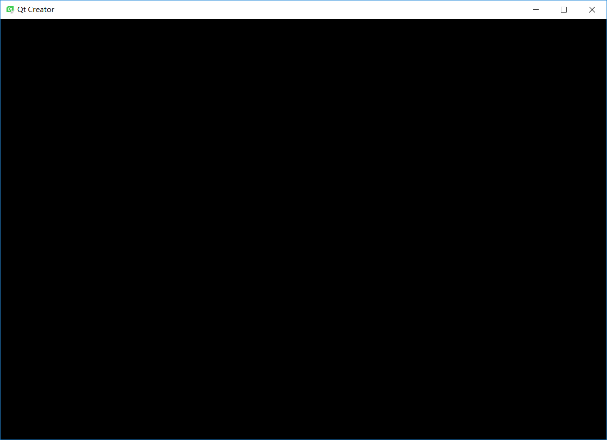

# docker-qtcreator
Run qtcreator in a Docker container
Test running GUI Docker application

# Setting
- Host: Windows 10
- X Server: VcXsrv
- Docker: Docker Desktop on Windows, Version 2.0.0.3 (31259)
- Container OS: centos:latest
- Qt: Qt Creator 4.1.0 based on Qt 5.9.2

# Execution
- Image building
    ```sh
    #!bin/bash

    echo 'This will take a lot of time...'
    docker build -t seisgo/qtcreator:0.1 .
    ```
- Container executing
    ```sh
    #!bin/bash

    # Set_Variable -name DISPLAY -value [your host ip]:0.0
    docker run -it --rm -e DISPLAY=$DISPLAY seisgo/qtcreator:0.1
    ```

# Results
- Installation: Success
- GUI execution:
    - Qt5: *Failure* with following information:
        ```sh
        QStandardPaths: XDG_RUNTIME_DIR not set, defaulting to '/tmp/runtime-developer'
        xkbcommon: ERROR: failed to add default include path /usr/share/X11/xkb
        Qt: Failed to create XKB context!
        Use QT_XKB_CONFIG_ROOT environmental variable to provide an additional search path, add ':' as separator to provide several search paths and/or make sure that XKB configuration data directory contains recent enough contents, to update please see http://cgit.freedesktop.org/xkeyboard-config/ .
        libGL error: unable to load driver: swrast_dri.so
        libGL error: failed to load driver: swrast
        QQuickWidget: Failed to make context current
        QQuickWidget::resizeEvent() no OpenGL context
        QQuickWidget: Failed to make context current
        QQuickWidget: Attempted to render scene with no context
        composeAndFlush: makeCurrent() failed
        composeAndFlush: makeCurrent() failed
        composeAndFlush: makeCurrent() failed
        composeAndFlush: makeCurrent() failed
        composeAndFlush: makeCurrent() failed
        QQuickWidget: Attempted to render scene with no context
        composeAndFlush: makeCurrent() failed
        QQuickWidget: Attempted to render scene with no context
        composeAndFlush: makeCurrent() failed
        composeAndFlush: makeCurrent() failed
        QQuickWidget: Attempted to render scene with no context
        composeAndFlush: makeCurrent() failed
        composeAndFlush: makeCurrent() failed
        composeAndFlush: makeCurrent() failed
        composeAndFlush: makeCurrent() failed
        composeAndFlush: makeCurrent() failed
        composeAndFlush: makeCurrent() failed
        composeAndFlush: makeCurrent() failed
        QQuickWidget::invalidateRenderControl could not make context current 
        ```
        The Displaying of QtCreator is like following image:
        
    - Qt4: *Failure*
        - Even I set the Dockerfile with "yum install -y http://mirror.centos.org/centos/7/os/x86_64/Packages/qt-4.8.7-2.el7.x86_64.rpm", Qt4 is not correctly installed, while it is still Qt 5.

# Solution
- - [ ] *Todo*
- Trail 1
    - According to some references ([1], [2], [3]), following operations are added in Dockerfile:
        ```sh
        yum install -y libxkbcommon libxkbcommon-devel libxkbcommon-x11 libxkbcommon-x11-devel \
        yum install -y libqtxdg libqtxdg-devel freeglut freeglut-devel \
        yum install -y mesa-libGL mesa-libGL-devel mesa-libEGL mesa-libGLU\ 
        ```
    - With above modification, failure information is as follows:
        ```sh
        QStandardPaths: XDG_RUNTIME_DIR not set, defaulting to '/tmp/runtime-developer'
        libGL error: unable to load driver: swrast_dri.so
        libGL error: failed to load driver: swrast
        QQuickWidget: Failed to make context current
        QQuickWidget::resizeEvent() no OpenGL context
        QQuickWidget: Failed to make context current
        QQuickWidget: Attempted to render scene with no context
        composeAndFlush: makeCurrent() failed
        composeAndFlush: makeCurrent() failed
        composeAndFlush: makeCurrent() failed
        ```
        We can see that some failures about *XKB* disapper.

# References
- [Run GUI app in linux docker container on windows host](https://dev.to/darksmile92/run-gui-app-in-linux-docker-container-on-windows-host-4kde)
- [Running GUI apps with Docker - Fabio Rehm's Blog](http://fabiorehm.com/blog/2014/09/11/running-gui-apps-with-docker/)
- [QT 5.4 ON RED HAT ENTERPRISE 5][3]

[1]: https://access.redhat.com/solutions/56301 "How to get OpenGL libraries in Red Hat Enterprise Linux 6."
[2]: https://github.com/pyqt/python-qt5/wiki/Compiling-for-CentOS-7 "pyqt/python-qt5: Compiling for CentOS 7"
[3]: https://kate-editor.org/2014/12/22/qt-5-4-on-red-hat-enterprise-5/ "QT 5.4 ON RED HAT ENTERPRISE 5"

